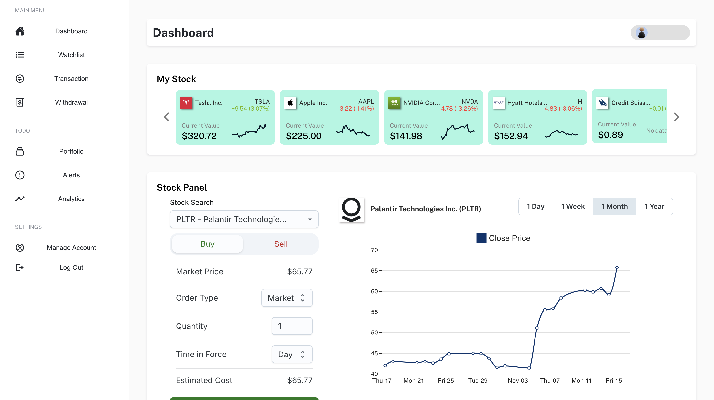

# Trading Dashboard

• Developed a scalable backend system using FastAPI to handle simultaneous API requests, managing user
authentication with OAuth2 and JWT, retrieving real-time stock data, and displaying historical trade records.
• Implemented secure data storage solutions with PostgreSQL, optimizing query performance through database
indexing and efficient schema design.
• Integrated third-party stock market APIs to fetch live stock data, ensuring data synchronization and handling API
rate limits.
• Used React to develop visually-stunning frontend components that display real-time stock prices, graphs etc.

